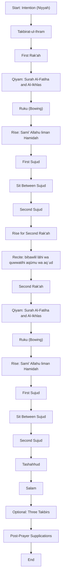

# Salat al-Fajr (Shi'a Practice) - Complete Guide

## Prayer Flow Diagram



## Preparation Steps

1. **Perform Wudu (Ritual Ablution):**
   - Ensure proper Wudu is performed.
   - If Wudu is invalidated, it must be repeated.
   - Ghusl or Tayammum should be performed if required.

2. **Proper Attire:**
   - **Men:** Cover body from navel to knees at minimum.
   - **Women:** Cover entire body except face and hands.
   - All clothing must be **tahir** (ritually pure).

3. **Prayer Space:**
   - Stand on a clean surface.
   - Place a **turbah** (clay tablet) for prostration.
   - Face the **Qibla** (direction of Kaaba).
   - Ensure the space is clean, quiet, and free from distractions.

4. **Timing:**
   - Pray between **true dawn (Fajr al-Sadiq)** and **sunrise**.

5. **Adhan and Iqama:**
   - It is recommended to recite both before starting the prayer.

---

## First Rak'ah

1. **Niyyah (Intention):**
   - Stand facing Qibla and make intention in your heart:
     ```
     I am praying two Rak'ahs of Fajr prayer, seeking nearness to Allah (Qurbatan ilallah).
     ```

2. **Takbirat-ul-Ihram:**
   - Raise hands to ears, palms facing forward, and fingers together.
   - Say:
     ```
     Allahu Akbar
     ```

3. **Qiyam (Standing):**
   - Recite Surah Al-Fatiha:
     ```
     Bismillah-ir-Rahman-ir-Rahim  
     Alhamdulillahi Rabbil Alamin  
     Ar-Rahman-ir-Rahim  
     Maliki Yawm-id-Deen  
     Iyyaka Na'budu wa Iyyaka Nasta'in  
     Ihdinas Sirat-al-Mustaqim  
     Sirat-al-Ladhina An'amta Alayhim  
     Ghayril Maghdubi Alayhim wa Lad-Dallin
     ```

   - Follow with Surah Al-Ikhlas:
     ```
     Bismillah-ir-Rahman-ir-Rahim  
     Qul huwa Allahu Ahad  
     Allahus-Samad  
     Lam yalid wa lam yulad  
     Wa lam yakun lahu kufuwan ahad
     ```

4. **Move to Ruku (Bowing):**
   - Say:
     ```
     Allahu Akbar
     ```

5. **Ruku (Bowing):**
   - Bend forward, keeping back straight and hands on knees.
   - Recite:
     ```
     Subhana Rabbiyal Azimi wa Bi Hamdih
     ```
   - Optionally, you can add:
     ```
     Subhanallah (3x)
     ```
   - Rise while saying:
     ```
     Sami' Allahu liman Hamidah
     ```

6. **First Sujud:**
   - Move to prostration saying:
     ```
     Allahu Akbar
     ```
   - Place forehead on turbah and recite:
     ```
     Subhana Rabbiyal A'la wa Bi Hamdih
     ```
   - Optionally, you can add:
     ```
     Subhanallah (3x)
     ```

7. **Between Sujud:**
   - Sit briefly and say:
     ```
     Astaghfirullaha Rabbi wa Atubu Ilayh
     ```

8. **Second Sujud:**
   - Say:
     ```
     Allahu Akbar
     ```
   - Repeat:
     ```
     Subhana Rabbiyal A'la wa Bi Hamdih
     ```
   - Optionally, you can add:
     ```
     Subhanallah (3x)
     ```

9. **Rise for the Second Rak'ah:**
   - Say while rising:
     ```
     Allahu Akbar
     ```
   - While standing, recite:
     ```
     biḥawlil lāhi wa quwwatihi aqūmu wa aqʿud
     ```
     (I stand and sit by the strength of Allah and by His power).

---

## Second Rak'ah

1. **Qiyam (Standing):**
   - Recite Surah Al-Fatiha and Surah Al-Ikhlas as in the first Rak'ah.

2. **Qunoot (Recommended):**
   - Raise hands to face, palms up.
   - Recite any supplication, such as:
     ```
     Rabbana Aatina Fid-Dunya Hasanatan  
     Wa Fil-Aakhirati Hasanatan  
     Wa Qina Adhab an-Nar
     ```

3. **Ruku:**
   - Perform Ruku as before and recite:
     ```
     Subhana Rabbiyal Azimi wa Bi Hamdih
     ```
   - Optionally, you can add:
     ```
     Subhanallah (3x)
     ```
   - Rise while saying:
     ```
     Sami' Allahu liman Hamidah
     ```

4. **First Sujud:**
   - Perform as in the first Rak'ah and recite:
     ```
     Subhana Rabbiyal A'la wa Bi Hamdih
     ```
   - Optionally, you can add:
     ```
     Subhanallah (3x)
     ```

5. **Between Sujud:**
   - Sit briefly and say:
     ```
     Astaghfirullaha Rabbi wa Atubu Ilayh
     ```

6. **Second Sujud:**
   - Say:
     ```
     Allahu Akbar
     ```
   - Recite again:
     ```
     Subhana Rabbiyal A'la wa Bi Hamdih
     ```
   - Optionally, you can add:
     ```
     Subhanallah (3x)
     ```

7. **Tashahhud:**
   - Sit and recite:
     ```
     Ashhadu an la ilaha illa Allah,  
     Wahdahu la sharika lah,  
     Wa ashhadu anna Muhammadan abduhu wa rasuluh.  
     Allahumma salli ala Muhammadin wa ali Muhammad.
     ```

8. **Salam:**
   - Conclude the prayer:
     ```
     Assalamu Alayka Ayyuhan Nabiyyu wa Rahmatullahi wa Barakatuh  
     Assalamu Alayna wa Ala Ibadillahis Salihin  
     Assalamu Alaykum wa Rahmatullahi wa Barakatuh
     ```

---

## Three Takbirs (Recommended Sunnah):

1. After completing the **Salam**, raise your hands to your ears for each Takbir.
2. Say:
   ```
   Allahu Akbar
   ```
   - Repeat this **three times**.

---

## Post-Prayer Recommendations

1. Recite **Tasbihat Fatima Zahra (AS):**
   - 34x Allahu Akbar  
   - 33x Alhamdulillah  
   - 33x Subhanallah

2. Supplications and Du'as:
   - Engage in personal prayers and ask Allah for your needs.

---
